# Architecture

How JobMatch works, and the order to read it in.

The four diagrams below are generated from the source by `scripts/build_docs.py`, so every count
and line number in them is current. The prose is hand-written; if it contradicts a diagram, the
diagram is right. For "X is broken, which file", use [INDEX.md](INDEX.md) — this document is for
understanding the shape, not for lookup. For a colour version of the same four pictures that
opens offline in a browser, [map.html](map.html).

> The version of this file before 2026-08-20 described a Streamlit app reading `jobs.csv` with
> "no database" and 26 boards. It had been wrong for three months. That is the reason the
> diagrams are generated now and the reason CI fails when they drift.

---

## Read it in this order

| When | Do | Why |
|---|---|---|
| **0–2 min** | [README.md](../README.md), first screen only | Three traps that each cost an afternoon, and a symptom → file table. |
| **2–12 min** | The four diagrams below, top to bottom | Surfaces, then intake, then deploy, then the triplet. |
| **12–60 min** | **Run it.** `python web.py`, click the feed, open a job, hit `/admin/health.json`. Then `python scripts/feed_parity.py`. | You can't hold 28,000 lines in your head, but you can hold "I clicked that and it did this." Running the parity gate makes diagram 4 real instead of a warning. |
| **1–3 h** | `web.py:1`–`330` (config and the four request hooks), then skim **only** `core.py`'s banner comments as a table of contents, then `db.py:1`–`95` | The smallest set that explains the other 26,000 lines. `core.py`'s banners are already an outline — read them as one. |
| **3–4 h** | [SESSION_HANDOFF_PROMPT.md](SESSION_HANDOFF_PROMPT.md), end to end | The most honest document here: every claim is measured, not remembered. It's fourth because it's organised as a session log, not an introduction. |
| **Day 1, PM** | Change one string in a template and ship it end to end through the zip | So the deploy path is muscle memory *before* it's urgent at 11pm. Highest-value onboarding exercise in the repo. |

Deliberately **not** in the first day: `scraper/__init__.py`'s ATS adapters. They're 29 variations
on one theme; read the one you need when you need it.

---

## 1. Three surfaces, one spine

Three separate places code runs, and the distinction is not cosmetic — a scheduled process has no
`session`, no `request`, and loses its filesystem when the run ends. That last one is why
`jdmeta.json` is a cache and not an artifact: it's built on a GitHub runner that is then thrown
away.

All three import `core.py`. That's why nothing presentational lives in it — rendering belongs in
`jdrender.py`, and a `core.py` that imported Flask would break the scraper.

```mermaid
flowchart TB
  subgraph REQ["&#9635; request-scoped"]
    W["<b>web.py</b><br/>7,931 lines · 85 routes / 84 handlers<br/>no blueprints"]
    T["templates/ · 31 files"]
  end
  subgraph SCH["&#9719; scheduled"]
    S["<b>scraper/__init__.py</b><br/>7,984 lines · 33 ATS adapters<br/>1,192 boards"]
    J["score_jobs.py · 1,986 lines"]
  end
  subgraph CLI["&#9723; browser"]
    E["<b>extension/</b><br/>10 files · 15 /api/ext/* routes"]
    A["static/app.js<br/>the client feed"]
  end
  SPINE["<b>THE SPINE</b> — imported by all three<br/>core.py · 3,101 lines · 32 sections<br/>db.py · 2,862 lines · four backends"]
  REQ --> SPINE
  SCH --> SPINE
  CLI --> SPINE
  SPINE --> D{"db.py::_LazyHTTP<br/>line 59"}
  D -->|"PG_DSN"| P["pgrest — direct psycopg<br/><i>the cPanel app</i>"]
  D -->|"DB_PROXY_URL + SECRET"| X["dbproxy — HMAC HTTPS<br/><i>Actions, your laptop</i>"]
  D -->|"half a pair"| R["RuntimeError<br/><i>refuses rather than guessing</i>"]
  D -->|"neither"| V["Supabase → local CSV<br/><i>vestigial</i>"]
  classDef web fill:#e0e4fe,stroke:#4f46e5,color:#101319
  classDef sched fill:#cfe8e3,stroke:#0f766e,color:#101319
  classDef client fill:#e4e7ec,stroke:#5f6573,color:#101319
  classDef trap fill:#f9edcd,stroke:#a8781a,color:#101319
  classDef plain fill:#ffffff,stroke:#d3d7df,color:#101319
  class W,T web
  class S,J sched
  class E,A client
  class R trap
  class SPINE,D,P,X,V plain
```

<!-- DIAGRAM: surfaces -->



<!-- /DIAGRAM -->

The database dispatch at the bottom is worth memorising, because it produces the most confusing
class of bug here: **a script that writes to the wrong place and exits 0.** `.env` is read
relative to the working directory, so a job that forgets to `cd` gets a different backend and
reports success. `DB_REQUIRE` turns that into a loud failure. And `using_supabase()` does not mean
what it says — it answers "is there a remote database at all" and is True for three of the four
backends. `backend_name()` is the one that tells you which.

---

## 2. Intake: the log tells you which gate fired

A scrape sweeps ~1,200 boards, then puts every posting it found through an ordered filter. Most
postings are dropped, which is correct — the corpus is a small fraction of what the boards serve.

The useful property: **each gate's drop counter is printed at the end of the run**, and the labels
on the diagram are those same strings, extracted from the same dict. So when a job you expected
isn't in the feed, read the run output, find the count that's higher than you expected, and the
diagram gives you the line number.

The diagram is ordered by the line that applies each gate, which is *not* the order the dict
declares them — "blocked company" is listed fifth and applied second.

<!-- DIAGRAM: funnel -->


<!-- /DIAGRAM -->

Two things the shape doesn't show:

- **Descriptions are bought *before* the gates**, not after. That's deliberate: a job whose title
  matched nothing can still be admitted on what its description says, and doing the fetch first
  means a JD-rescued row takes exactly the same path as a title match rather than a special one.
- **The breadcrumb is written before the database call.** `last_new_jobs.json` lands first, so a
  database hiccup costs you the insert but not the scrape.

After intake, three separate passes do the rest: scoring (`scraper/score_jobs.py`), real posting
dates (`scraper/verify_dates.py`, against an external API at ~54 requests/minute), and repost
clustering (`scraper/reposts.py`).

---

## 3. Deploy: the push does nothing

This is the single most misleading thing about the repository, so it gets a diagram of its own.

```mermaid
flowchart LR
  subgraph BAD["&#9888; looks like a deploy, is not"]
    L["your laptop<br/>git push"] --> G["GitHub<br/><i>origin</i>"]
    G -.->|"NEVER RUNS"| C[".cpanel.yml"]
  end
  subgraph GOOD["&#9635; the actual deploy"]
    B["build_deploy_zip.py<br/>17 modules + 4 dirs"] --> Z["stemjobs1_deploy.zip"]
    Z --> U["File Manager<br/>upload + extract"]
    U --> T["touch tmp/restart.txt"] --> LIVE["stemjobs1.astrochakra.co"]
  end
  classDef trap fill:#f9edcd,stroke:#a8781a,color:#101319
  classDef sched fill:#cfe8e3,stroke:#0f766e,color:#101319
  classDef plain fill:#ffffff,stroke:#d3d7df,color:#101319
  class C trap
  class B,Z,U,T,LIVE sched
  class L,G plain
```

<!-- DIAGRAM: deploy -->



<!-- /DIAGRAM -->

`.cpanel.yml` is present and correct and has never once run, because cPanel only executes it for a
repository *hosted on cPanel* and this origin is GitHub. Verified on 2026-08-09 by pushing a full
release and then polling the live site for five minutes: the served CSS never changed.

Step-by-step commands are in [OPERATIONS.md](OPERATIONS.md).

---

## 4. The filter triplet

If you change one thing in this codebase without understanding its neighbours, make it not be
this one. "Does this job match this search" is implemented three times, in three languages'
worth of context, and all three must agree.

<!-- DIAGRAM: triplet -->

```mermaid
flowchart TB
  S["<b>the server feed</b><br/>web.py::_filter_rows<br/><i>line 1820</i>"]
  C["<b>the client feed</b><br/>static/app.js::matches()<br/><i>line 804</i>"]
  S <-->|"_FEED_INLINE_MAX = 4000<br/>below → browser filters<br/>above → server filters"| C
  GUARD["&#128274; scripts/feed_parity.py<br/><i>lifts the JS by source text and runs it in node<br/>— the only thing keeping these two in step</i>"]
  S --- GUARD
  C --- GUARD
  D["<b>the email digest</b><br/>core.py::prefs_match<br/><i>line 2390 — shares the filters, skips \"posted within\"</i>"]
  GUARD -.-> D
  classDef web fill:#e0e4fe,stroke:#4f46e5,color:#101319
  classDef client fill:#e4e7ec,stroke:#5f6573,color:#101319
  classDef sched fill:#cfe8e3,stroke:#0f766e,color:#101319
  classDef trap fill:#f9edcd,stroke:#a8781a,color:#101319
  class S web
  class C client
  class D sched
  class GUARD trap
```

<!-- /DIAGRAM -->

The server/client split exists for a real reason: below the threshold the browser gets the whole
corpus and filtering is instant with no round trip; above it that payload is too large, so the
server filters and pages. The consequence is that **the feed silently changes which
implementation it uses as the corpus grows**, so a divergence between them is invisible until the
corpus crosses 4,000 and then affects everything.

`scripts/feed_parity.py` is the only thing preventing that. It works by lifting the pure functions
out of `static/app.js` *as source text* and running them in node, so it tests what actually ships
rather than a Python re-implementation of it. The price is one constraint: a lifted helper must
stay a top-level `function`, not a `var`.

---

## The module tour

| File | Owns | Note |
|---|---|---|
| `web.py` | Every route and request hook | One module, no blueprints. Read the hooks first — CSRF, CSP, gzip and the auto page-view all live there and all run on every request. |
| `core.py` | The domain: filtering, scoring, sponsorship, visa tags, location, salary, role tracks, prefs, work-auth timelines | Imported by all three surfaces. Organised by banner comment; those banners are the outline. |
| `db.py` | Storage | One PostgREST-shaped interface, four backends, chosen at first use. |
| `pgrest.py` | Transport 1 | Reimplements PostgREST's verbs over psycopg, so the same call works locally and on the box. |
| `dbproxy.py` | Transport 2 | HMAC-signed HTTPS. The only way off-host code reaches the database, since `PG_DSN` is loopback-only. |
| `scraper/__init__.py` | The sweep, the intake filter, and 29 ATS adapters | Also the add-a-board detect chain. |
| `scraper/score_jobs.py` | Fetching descriptions and scoring them | Resumable, budgeted, and reconciles two stores of the same data. |
| `resume_score.py` | The offline résumé rubric | No network, no model, deterministic. ~25 checks behind a weight table. |
| `resume_brain/` | The AI tailoring layer | Separate product from the grader; they share `core.py`'s matcher and one voice module, so they can't disagree about what a filler word is. |
| `jdrender.py` | Description → HTML | Deliberately outside `web.py` and `core.py`. Byte-frozen against a fixture. |
| `analytics.py` | Event capture | Reads `EV_OFF` once, at import. |
| `static/app.js` | The client feed | Twin of `web.py`'s filter and card builder. Invisible to ripgrep — see [INDEX.md](INDEX.md). |
| `web/` | React islands | A separate Vite/TypeScript project, not a Python package. Builds into `static/dist/`, which is committed because the server runs no build step. |
| `app.py` | Nothing | Retired Streamlit. Still boots, which is the trap. |

---

## Invariants

Things that are true on purpose, and expensive to rediscover.

1. **Absence of a sponsorship record is not evidence of non-sponsorship.** The feed is never
   filtered on it; it's shown as a signal, not a gate.
2. **Employer floods are grouped, never deduplicated.** Fifty real openings at one company are
   fifty real openings; collapsing them loses information the user wants.
3. **The match number is absolute, not relative.** A percentile answers a different question than
   the label asks, and because the feed *sorts* on this number, a percentile saturates and
   destroys the ranking it was meant to improve.
4. **A timestamped `found_date` is our scrape time, not a posting date.** Real posting dates live
   in `posted_verified`, populated by a separate pass, and only exist for the subset the external
   API could confirm.
5. **`jobs.jd_terms` is TEXT, not jsonb, and its key order is semantic.** It's the analyzer's
   frozen term order; it breaks ties in the skill panel, and the scorer diffs the stored string to
   decide whether to write at all. Converting it re-upserts the whole corpus every run.
6. **Colour means sponsorship.** `static/style.css` states the rule and enforces a three-layer
   token system, and CI checks the contrast. These docs use a different palette on purpose.
7. **Never load-test production.** Shared cPanel throttles at the account level, no restart
   clears it, and the previous account was suspended once.
