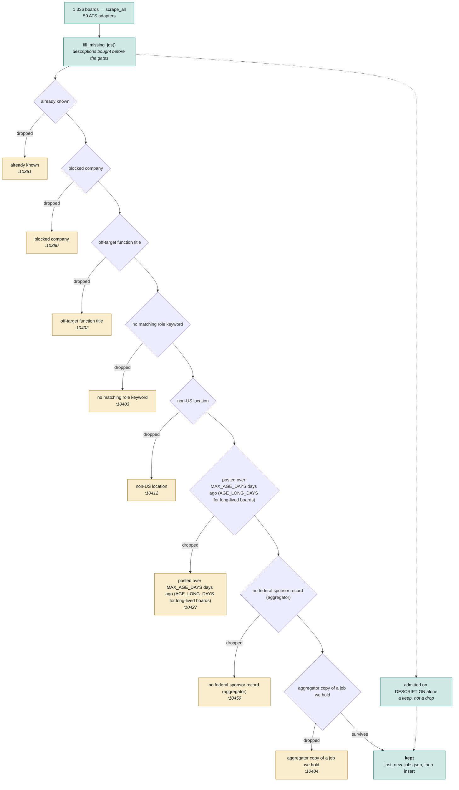

# Architecture

How JobMatch works, and the order to read it in.

The four diagrams below are generated from the source by `scripts/build_docs.py`, so every count
and line number in them is current. The prose is hand-written; if it contradicts a diagram, the
diagram is right. For "X is broken, which file", use [INDEX.md](INDEX.md) — this document is for
understanding the shape, not for lookup. For a colour version of the same four pictures that
opens offline in a browser, [map.html](map.html).

**The prose was last re-verified against the code on 2026-09-14.** Where a hand-written number
could rot, this document now names the constant or the function rather than the value.

> The version of this file before 2026-08-20 described a Streamlit app reading `jobs.csv` with
> "no database" and 26 boards. It had been wrong for three months. That is the reason the
> diagrams are generated now and the reason CI fails when they drift.

---

## Read it in this order

| When | Do | Why |
|---|---|---|
| **0–2 min** | [README.md](../README.md), first screen only | Three traps that each cost an afternoon, and a symptom → file table. |
| **2–12 min** | The four diagrams below, top to bottom | Surfaces, then intake, then deploy, then the triplet. §3 (the data model) and §6 (the caches) have no diagram and are the two things most often missing from a mental model of this app. |
| **12–60 min** | **Run it.** `python web.py`, click the feed, open a job, hit `/admin/health.json`. Then `python scripts/feed_parity.py`. | You can't hold 28,000 lines in your head, but you can hold "I clicked that and it did this." Running the parity gate makes diagram 4 real instead of a warning. |
| **1–3 h** | `web.py:1`–`330` (config and the four request hooks), then skim **only** `core.py`'s banner comments as a table of contents, then `db.py:1`–`95` | The smallest set that explains the other 26,000 lines. `core.py`'s banners are already an outline — read them as one. |
| **3–4 h** | [SESSION_HANDOFF_PROMPT.md](SESSION_HANDOFF_PROMPT.md), end to end | The most honest document here: every claim is measured, not remembered. It's fourth because it's organised as a session log, not an introduction. |
| **Day 1, PM** | Change one string in a template and ship it end to end through the zip | So the deploy path is muscle memory *before* it's urgent at 11pm. Highest-value onboarding exercise in the repo. |

Deliberately **not** in the first day: `scraper/__init__.py`'s ATS adapters. They're 38 variations
on one theme; read the one you need when you need it.

---

## 1. Three surfaces, one spine

Three separate places code runs, and the distinction is not cosmetic — a scheduled process has no
`session`, no `request`, and loses its filesystem when the run ends. That last one is why
`jdmeta.json` is a cache and not an artifact: it's built on a GitHub runner that is then thrown
away.

All three import `core.py`. That's why nothing presentational lives in it — rendering belongs in
`jdrender.py`, and a `core.py` that imported Flask would break the scraper.

```mermaid
flowchart TB
  subgraph REQ["&#9635; request-scoped"]
    W["<b>web.py</b><br/>10,313 lines · 88 routes / 87 handlers<br/>no blueprints"]
    T["templates/ · 33 files"]
  end
  subgraph SCH["&#9719; scheduled"]
    S["<b>scraper/__init__.py</b><br/>10,664 lines · 59 ATS adapters<br/>1,336 boards"]
    J["score_jobs.py · 2,650 lines"]
  end
  subgraph CLI["&#9723; browser"]
    E["<b>extension/</b><br/>10 files · 15 /api/ext/* routes"]
    A["static/app.js<br/>the client feed"]
  end
  SPINE["<b>THE SPINE</b> — imported by all three<br/>core.py · 5,698 lines · 40 sections<br/>db.py · 4,103 lines · two transports + CSV"]
  REQ --> SPINE
  SCH --> SPINE
  CLI --> SPINE
  SPINE --> D{"db.py::_LazyHTTP<br/>line 47"}
  D -->|"PG_DSN"| P["pgrest — direct psycopg<br/><i>the cPanel app</i>"]
  D -->|"DB_PROXY_URL + SECRET"| X["dbproxy — HMAC HTTPS<br/><i>Actions, your laptop</i>"]
  D -->|"half a pair"| R["RuntimeError<br/><i>refuses rather than guessing</i>"]
  D -->|"neither"| V["local CSV<br/><i>no credentials: the laptop fallback</i>"]
  classDef web fill:#e0e4fe,stroke:#4f46e5,color:#101319
  classDef sched fill:#cfe8e3,stroke:#0f766e,color:#101319
  classDef client fill:#e4e7ec,stroke:#5f6573,color:#101319
  classDef trap fill:#f9edcd,stroke:#a8781a,color:#101319
  classDef plain fill:#ffffff,stroke:#d3d7df,color:#101319
  class W,T web
  class S,J sched
  class E,A client
  class R trap
  class SPINE,D,P,X,V plain
```

<!-- DIAGRAM: surfaces -->



<!-- /DIAGRAM -->

The database dispatch at the bottom is worth memorising, because it produces the most confusing
class of bug here: **a script that writes to the wrong place and exits 0.** `.env` is read
relative to the working directory, so a job that forgets to `cd` gets a different backend and
reports success. `DB_REQUIRE` turns that into a loud failure.

**There used to be a third transport and it was the default.** An unauthenticated Supabase REST
session, reached by any process that had neither `PG_DSN` nor `DB_PROXY_*` — so a
misconfiguration silently read and wrote the database this project left on 2026-08-15, and
`scripts/dump_schema.py` printed that database's schema as "live" for two weeks. It was deleted
on 2026-09-01 and what replaced it is a refusal: a **half-set** `DB_PROXY_*` pair raises naming
the missing variable, and so does asking for a session with nothing configured at all. What is
left under "neither" is the local CSV, which is a genuine fallback for a laptop with no
credentials, not a database.

`using_supabase()` went with it. It is now **`db.has_remote_db()`** — 99 call sites, renamed
because a predicate named after a backend that no longer exists is worse than a wide diff. It
answers "is there a remote database at all" and is True for **both** transports;
**`db.backend_name()` is the one that tells you which**, and it is what a run should print.

One more consequence of that removal: the Flask session key used to fall back to
`sha256(SUPABASE_KEY)`. With that gone the only fallback left is a machine-local dev value
derived from the hostname and file path, which is guessable — so **`APP_SECRET` is required
whenever a remote database is configured** and `web.py` refuses to import without it rather than
sign cookies and extension tokens with a guessable key.

---

## 2. Intake: the log tells you which gate fired

A scrape sweeps ~1,200 boards, then puts every posting it found through an ordered filter. Most
postings are dropped, which is correct — the corpus is a small fraction of what the boards serve.

The useful property: **each gate's drop counter is printed at the end of the run**, and the labels
on the diagram are those same strings, extracted from the same dict. So when a job you expected
isn't in the feed, read the run output, find the count that's higher than you expected, and the
diagram gives you the line number.

The diagram is ordered by the line that applies each gate, which is *not* the order the dict
declares them — "blocked company" is listed fifth and applied second.

<!-- DIAGRAM: funnel -->



<!-- /DIAGRAM -->

Two things the shape doesn't show:

- **Descriptions are bought *before* the gates**, not after. That's deliberate: a job whose title
  matched nothing can still be admitted on what its description says, and doing the fetch first
  means a JD-rescued row takes exactly the same path as a title match rather than a special one.
- **The breadcrumb is written before the database call.** `last_new_jobs.json` lands first, so a
  database hiccup costs you the insert but not the scrape.

After intake, three separate passes do the rest: scoring (`scraper/score_jobs.py`), real posting
dates (`scraper/verify_dates.py`, against an external API at ~54 requests/minute), and repost
clustering (`scraper/reposts.py`).

### The other sweep, the one that is not an intake path

`scripts/jobspy_sweep.py` asks LinkedIn and Indeed what is being posted and writes exactly one
table, `jobspy_findings`. Read its name as a *ledger*, not a feed: it does not write `jobs`, does
not write `boards`, touches no company table and adopts nothing. **The value is the employers,
not the postings** — a company that appears there and that we do not already scrape is a board
worth adopting, and the posting is the evidence for that. `scripts/review_findings.py` is the
only reader; adoption stays the separate, reviewable step it already was (probe → adopt).

This is not a reversal of "don't reach for a job aggregator". Adzuna was removed on 2026-08-16
because at 6% of the *feed* it was 38% of every job with no usable description; routing these
rows into the corpus would repeat that exactly. Runs Tue + Thu on
`.github/workflows/jobspy-sweep.yml`.

---

## 3. The data model: one corpus, four tables

Nothing in this document described the storage layout before 2026-09-14, which is a gap a reader
hits within an hour: `db.py` talks about `job_facts` and `MOVED_OFF_JOBS`, and `jobs` no longer
has the columns the old code reads.

**The corpus is one posting per URL, split across four tables**, contracted out of a single wide
`jobs` in the 2026-09-07 schema revamp. Each `MIGRATION_*.sql` in the app root states the measured
case for its own split; the sizes quoted below come from those files and from `db.py`, not from a
whole-database number, because the only whole-database figures in circulation disagree with each
other (a later on-box survey measured 623 MB where the revamp notes said 437):

| Table | Holds | Why it is separate |
|---|---|---|
| `jobs` | What the employer published (title, company, location, url) plus what we track (`first_seen`, `is_active`, `jd_fp`, `facts_fp`) | The spine. Small enough that `select=*` is survivable. |
| `job_descriptions` | The description text | Postgres already stores it out of line, so this saves no disk. What it buys is that `select=*` on `jobs` cannot return 263 MB by accident — which it did twice in one afternoon. |
| `job_facts` | The nine things *reading* a description told us: `loc_state`, `loc_metro`, `remote`, `salary_min/max/period`, `exp_max_years`, `sponsor_jd`, `sponsor_reason` | Derived, not published. `db.py::FIELDS` had grouped them with a comment saying exactly that long before there was a table. |
| `job_terms` | The packed keyword analysis, `jd_terms` | 55% of the corpus read on its own, and it sat **resident in every Passenger worker**: 69.8 MB / 45.1 s with it against 31.1 MB / 27.2 s without, measured on the box over 47,133 rows. The memory is the argument, more than the seconds. |

Four rules that are each a bug someone already shipped:

1. **`db.JOB_FACTS_COLS` and `db.MOVED_OFF_JOBS` are the one definition of which columns moved.**
   Every writer, reader, backfill and verify derives its list from those, because the failure mode
   of a column in one list and not another is not an error — it is `_persist_derived` diffing
   against a value it never read, concluding every row changed, and re-upserting the whole corpus
   on every run for ever.
2. **`facts_fp` is deliberately on BOTH `jobs` and `job_facts`.** The staleness query is
   `where jd_fp is distinct from facts_fp` and pgrest translates no joins, so the one column that
   would need one stays duplicated on purpose.
3. **Each split table has a `*_ready()` gate** (`db.job_facts_ready()` and friends), stamped by
   its backfill. Until it is stamped, readers use the old columns. That is what let the migration
   run in steps against a live site, and it is why an unrun migration degrades rather than breaks.
4. **A new table must be added to `dbproxy.ALLOWED_TABLES`, and forgetting it fails
   asymmetrically.** The cPanel app reaches Postgres directly and works without the entry; Actions
   and your laptop reach it only through the proxy and get `403 table not allowed`, which reads
   like an auth failure. `jobspy_findings` cost five runs to this exact mistake.

The rest of the schema, by who it belongs to:

- **Employers** — `companies` (sector and employer-level facts) with `data_versions` carrying the
  version stamp the row cache keys on; `boards` (the adopted ATS boards, which is why an employer
  can be scraped daily and still not appear in the `SOURCES` dict in code); `blocked_companies`;
  `wishlist` (an employer somebody asked for whose board we could not read — a repeat wish merges
  and increments `requests` rather than duplicating).
- **People** — `users`, `profiles`, `resumes`, `resume_files`, `user_jobs` (save / hide / applied),
  `applications`, `learned_answers` (the extension's answer bank), `user_scores` (§6).
- **Operational** — `events` and `events_daily`, `admin_audit`, `scrape_status` (what the "Update
  jobs" button polls), `tailored_cache`, `brain_companies`, `jobspy_findings`.

**Do not read `schema.sql` as the census.** It describes 14 tables; `dbproxy.ALLOWED_TABLES` names
24. It is regenerated by `scripts/dump_schema.py` against whatever database that script is pointed
at, which is the same class of mistake as the Supabase default above. The allowlist is the list
that cannot be behind, because a missing entry breaks a real run.

---

## 4. Deploy: the push does nothing

This is the single most misleading thing about the repository, so it gets a diagram of its own.

```mermaid
flowchart LR
  subgraph BAD["&#9888; looks like a deploy, is not"]
    L["your laptop<br/>git push"] --> G["GitHub<br/><i>origin</i>"]
    G -.->|"NEVER RUNS"| C[".cpanel.yml"]
  end
  subgraph GOOD["&#9635; the actual deploy"]
    B["build_deploy_zip.py<br/>19 modules + 4 dirs"] --> Z["stemjobs1_deploy.zip"]
    Z --> U["File Manager<br/>upload + extract"]
    U --> T["touch tmp/restart.txt"] --> W["curl /warm?t=…<br/><i>or the first visitor rebuilds every cache</i>"] --> LIVE["stemjobs1.astrochakra.co"]
  end
  classDef trap fill:#f9edcd,stroke:#a8781a,color:#101319
  classDef sched fill:#cfe8e3,stroke:#0f766e,color:#101319
  classDef plain fill:#ffffff,stroke:#d3d7df,color:#101319
  class C trap
  class B,Z,U,T,W,LIVE sched
  class L,G plain
```

<!-- DIAGRAM: deploy -->



<!-- /DIAGRAM -->

`.cpanel.yml` is present and correct and has never once run, because cPanel only executes it for a
repository *hosted on cPanel* and this origin is GitHub. Verified on 2026-08-09 by pushing a full
release and then polling the live site for five minutes: the served CSS never changed.

**`touch tmp/restart.txt` is not the last step, and the missing one is not politeness.** A restart
empties every per-process cache the app has — the 29.4 MB IDF table, `_base_rows_cache`, the
live-analysis memo — so whoever opens the feed next rebuilds all of it on their own request.
`curl "https://stemjobs1.astrochakra.co/warm?t=$WARM_TOKEN"` pays that off everybody's path
(§6).

**And a deploy is not the only thing that makes a cold worker.** `stderr.log` on the box is a list
of `killed by signal: 9` — Passenger children hitting the account's memory cap and being
replaced, which no deploy step can anticipate. Measured 2026-09-06: a worker started at 00:49:51
served its first feed render at 00:53:11 in **17,216 ms** against a steady state of 80–170 ms,
with nobody having deployed for three and a half hours. So the warm curl closes the deploy case
and a five-minute cron closes the recycle case, and neither is redundant. One call warms one
*worker*, so the cron loops it four times.

Step-by-step commands, the crontab as it actually reads, and the schedule are in
[OPERATIONS.md](OPERATIONS.md).

---

## 5. The filter triplet

If you change one thing in this codebase without understanding its neighbours, make it not be
this one. "Does this job match this search" is implemented three times, in three languages'
worth of context, and all three must agree.

<!-- DIAGRAM: triplet -->

```mermaid
flowchart TB
  S["<b>the server feed</b><br/>web.py::_filter_rows<br/><i>line 2969</i>"]
  C["<b>the client feed</b><br/>static/app.js::matches()<br/><i>line 1084</i>"]
  S <-->|"_FEED_INLINE_MAX = 4000<br/>below → browser filters<br/>above → server filters"| C
  GUARD["&#128274; scripts/feed_parity.py<br/><i>lifts the JS by source text and runs it in node<br/>— the only thing keeping these two in step</i>"]
  S --- GUARD
  C --- GUARD
  D["<b>the email digest</b><br/>core.py::prefs_match<br/><i>line 4130 — shares the filters, skips \"posted within\"</i>"]
  GUARD -.-> D
  classDef web fill:#e0e4fe,stroke:#4f46e5,color:#101319
  classDef client fill:#e4e7ec,stroke:#5f6573,color:#101319
  classDef sched fill:#cfe8e3,stroke:#0f766e,color:#101319
  classDef trap fill:#f9edcd,stroke:#a8781a,color:#101319
  class S web
  class C client
  class D sched
  class GUARD trap
```

<!-- /DIAGRAM -->

The server/client split exists for a real reason: below the threshold the browser gets the whole
corpus and filtering is instant with no round trip; above it that payload is too large, so the
server filters and pages. The consequence is that **the feed silently changes which
implementation it uses as the corpus grows**, so a divergence between them is invisible until the
corpus crosses 4,000 and then affects everything.

`scripts/feed_parity.py` is the only thing preventing that. It works by lifting the pure functions
out of `static/app.js` *as source text* and running them in node, so it tests what actually ships
rather than a Python re-implementation of it. The price is one constraint: a lifted helper must
stay a top-level `function`, not a `var`.

---

## 6. The read path, and the caches behind it

Nothing about this was in this document before 2026-09-01, which is a gap: a feed render touches
nine caches, and the difference between hitting them and missing them is tens of milliseconds
against several seconds. Every layer here exists because a measurement said so, and each is listed
with the constant that bounds it rather than a number that can rot.

Read top to bottom; each layer exists because the one below it is expensive.

| layer | scope | key | bound / TTL |
|---|---|---|---|
| `_rows_cache` | process, LRU | (user, résumé md5, **corpus**) | `_cache_max()` |
| `_base_rows_cache` | process, **exactly one entry** | `(jobs_fingerprint(), _derived_signature())` | replaced, never appended |
| `row_cache/*.rows.gz` | **file, shared by every worker** | the same pair | `_ROWS_MAX_FILES` 3 |
| `_score_cache` | process, LRU | (user, résumé md5, **corpus**) | `_cache_max()` |
| `score_cache/<sha256>.json.gz` | **file, shared by every worker** | (user, résumé md5), corpus fingerprint stored inside | `_SCORES_MAX_FILES` 64, oldest mtime evicted |
| `user_scores` | the database | (user, job, `resume_fp`) | no TTL; the résumé hash is the guard — invariant 9 |
| `_jobs_cache` | process | — | `_JOBS_TTL` 3600 s |
| `jobs_snapshot.json.gz` | **file, shared by every worker** | — | revalidated against `db.jobs_fingerprint()` up to `_SNAPSHOT_MAX_AGE` 24 h |
| `db.load_jobs(include_jd=False)` | the database | — | last resort; the JD column is the difference between ~11 MB and ~168 MB |
| `idf.json.idx` | **file, mmap'd, shared via the OS page cache** | blake2b of `idf.json`'s bytes | refused on a mismatch, never repaired |
| `_status_cache` | process | user | `_STATUS_TTL` 30 s, busted on every action |
| `_profile_cache` / `_resume_cache` | process | user | `_RESUME_TTL` 60 s |

**A file is the only cache several short-lived processes can share.** Passenger runs a pool and
recycles it freely, so the on-disk layers are what stop each new worker paying full price — and
why a keep-warm ping alone never fixed the cold feed. `/warm` is one HTTP request and therefore
reaches *one* worker: warming four in parallel still left three of the next eight probes landing
cold at 6.3–7.0 s. A cron cannot win that race; a shared file removes it.

**Only `score` is per-user.** `_build_row` emits 41 keys and one of them depends on the reader, so
`_base_rows()` builds the other 40 once per corpus and `ranked_rows` overlays the score onto
shallow copies. Two consequences that are easy to undo by accident:

- `_dedupe_rows` must run **after** the overlay, because `_dupe_rank` tie-breaks on the score.
- `_cache_max()` is a **byte budget**, not a count: `_CACHE_BUDGET_MB` (256) divided by the
  measured `_ROW_CACHE_BYTES_PER_ROW` at today's row count, with the shared build charged one
  entry so it is honest about the memory it holds. A count cap gets more dangerous every time the
  scraper runs; a byte budget does not. At ~38,800 rows it leaves **2** per-user entries, at
  ~22,000 it is 4, and the floor is 1 — if it lands there the answer is to raise
  `CACHE_BUDGET_MB`, not to quietly overspend it.

### The built rows are persisted now, and the key is the whole design

This used to say *don't* persist them, on the grounds that a built row embeds `logo_url`,
`sponsor_counts` and `visa_index` output that `jobs_fingerprint()` covers none of. That objection
was right and the conclusion was wrong: the fix is to put those inputs **in the key**. Three rules
came out of it, each one a bug that shipped:

1. **`_derived_signature()` hashes file CONTENT, memoised on the stat.** Keyed on mtime, a deploy
   — a zip extract, so every file rewritten and not a byte changed — invalidated all 40k
   rows and charged the first visitor ~7 s. Hashing 6.2 MB is 11.9 ms, so the memo is a fast path
   and never an authority.
2. **Nothing that can fail silently may be in the key.** It once included two KV maps read over
   the network whose readers swallow a failure into `{}`. Workers computed different keys, each
   rebuilt for ~7 s and overwrote the other's file: production showed 63 ms and 8,401 ms in the
   same second, two workers ping-ponging a file neither could read.
3. **A request never writes the file.** `/warm` (`persist=True`) and a from-scratch build do. The
   gzip is most of the cost, and charging it to whoever loads the feed next is the regression this
   replaced.

`scripts/test_speed_caches.py` gates all three. The file is **pickle, not JSON**, and that is
measured rather than stylistic: at 40,294 rows json+gzip6 reads back in 587 ms and pickle+gzip1 in
343 ms — and pickle round-trips a tuple as a tuple, where JSON returned `visa` as a list and
needed another ~200 ms fix-up pass over every row.

### The IDF table is a lookup, not a million objects

`idf.json` is a flat `{term: float}` map, now 1,015,658 terms / 29.4 MB, and **not one call site
in the app iterates it** — every consumer asks `idf.get(term, default)`. Yet `json.load` built
the whole dict in every worker on that worker's first feed render: 1,130 ms and **+113 MB
resident**. On an account capped at ~1.2 GB whose workers sit near 800 MB, the 113 MB mattered
more than the second — the dict was feeding the kill/restart cycle that kept producing cold
workers.

A faster format was not the answer; the cost is building a million Python objects, not parsing
(marshal measured *slower* than json). So `core.py` does not materialise it: `idf.json.idx` is an
open-addressed hash table, mmap'd, one probe per lookup — 14 ms to open, 66 ms to verify its
stamp, ~0 resident because the pages are file-backed and shared. It follows the row cache's rules
for the same reasons: the stamp is over **content, not mtime**, a mismatch is **refused rather
than repaired** (falling back to `json.load`, i.e. the old behaviour, so the worst case is the
status quo), and nothing on a request path builds it — `/warm` and the scripts do.

### Invalidation, and the trap in it

`jobs_fingerprint()` is `(row count, max first_seen, scored count)`. The first two move on
**inserts only**; the third counts the rows holding `jd_terms`, so it moves when the scoring pass
writes. It was added on 2026-09-04 because without it a card read "JD pending" at score 0 while
the job page — which fetches the description live on the url key — scored the same posting
at 18%. The scrape inserts a bare row, which moves the first two and freezes a snapshot holding
`jd_terms` NULL; the score pass then fills that column by UPDATE, which moved nothing the probe
could see. Past `_JOBS_TTL` the probe re-confirmed "unchanged" and restamped the sidecar, so the
wrong answer renewed itself hourly and only the next insert ever broke the loop.

`db.update_job_fields` still moves **nothing** when it writes a column the fingerprint does not
count — the extension's JD patch writes `jd`, `location` and `found_date`, never `jd_terms`. A
re-read therefore returns an *equal* fingerprint while the underlying descriptions have changed,
so anything keyed on it would serve stale rows for ever. `_invalidate_jobs()` exists for exactly
this and clears the jobs cache, the base rows and the snapshot together; `/reload` and
`_bust_job_caches` additionally drop the stored score files. The same function also refuses to key
on the probe's "don't know" answer, `db.FP_UNKNOWN` — a non-empty and therefore truthy tuple,
which is why every caller tests `fp[0]` and why `web._corpus_key()` is the single place that rule
is written down.

**The per-user caches carry the corpus too**, and did not until the same date. `_score_cache` and
`_rows_cache` were keyed on `(user, résumé)` alone, and nothing clears them when the
corpus moves on its own — `_bust_job_caches`, `/reload` and the onboarding prefs step are all
explicit *actions*. A warm worker therefore went on serving its first render's rows through any
number of scrapes, which defeated the fingerprint above it however correct that became.

## The module tour

| File | Owns | Note |
|---|---|---|
| `web.py` | Every route and request hook | One module, no blueprints. Read the hooks first — CSRF, CSP, gzip and the auto page-view all live there and all run on every request. |
| `core.py` | The domain: filtering, scoring, sponsorship, visa tags, location, salary, role tracks, prefs, work-auth timelines | Imported by all three surfaces. Organised by banner comment; those banners are the outline. |
| `db.py` | Storage | One PostgREST-shaped interface, two transports plus a local-CSV fallback, chosen at first use. Also the schema contract: `FIELDS`, `JOB_FACTS_COLS`, `MOVED_OFF_JOBS` (§3). |
| `pgrest.py` | Transport 1 | Reimplements PostgREST's verbs over psycopg, so the same call works locally and on the box. |
| `dbproxy.py` | Transport 2 | HMAC-signed HTTPS. The only way off-host code reaches the database, since `PG_DSN` is loopback-only. |
| `scraper/__init__.py` | The sweep, the intake filter, and every ATS adapter | Also the add-a-board detect chain. The adapter count is on diagram 1, generated — don't hand-type it here. |
| `scraper/score_jobs.py` | Fetching descriptions and scoring them | Resumable, budgeted, and reconciles two stores of the same data. |
| `resume_score.py` | The offline résumé rubric | No network, no model, deterministic. ~25 checks behind a weight table. |
| `resume_brain/` | The AI tailoring layer | Separate product from the grader; they share `core.py`'s matcher and one voice module, so they can't disagree about what a filler word is. |
| `jdrender.py` | Description → HTML | Deliberately outside `web.py` and `core.py`. Byte-frozen against a fixture. |
| `analytics.py` | Event capture | Reads `EV_OFF` once, at import. |
| `static/app.js` | The client feed | Twin of `web.py`'s filter and card builder. Invisible to ripgrep — see [INDEX.md](INDEX.md). |
| `web/` | React islands | A separate Vite/TypeScript project, not a Python package. Builds into `static/dist/`, which is committed because the server runs no build step. |
| `scripts/` | 88 build, probe, migration and test scripts | Not a package — each is a `python scripts/x.py` entry point. The ones that gate CI are named in [OPERATIONS.md](OPERATIONS.md); `build_docs.py` regenerates this document's diagrams. |
| `bin/cron_scrape.sh` | The cPanel half of the schedule | `flock -n` so runs skip rather than stack, truncates its own log, `cd`s to the app dir so `.env` resolves. Its header records the live crontab, which the repo cannot enforce. |
| `app.py` | Nothing | Retired Streamlit. Still boots, which is the trap. |

---

## Invariants

Things that are true on purpose, and expensive to rediscover.

1. **Absence of a sponsorship record is not evidence of non-sponsorship.** The feed is never
   filtered on it; it's shown as a signal, not a gate.
2. **Employer floods are grouped, never deduplicated.** Fifty real openings at one company are
   fifty real openings; collapsing them loses information the user wants.
3. **The match number is absolute, not relative.** A percentile answers a different question than
   the label asks, and because the feed *sorts* on this number, a percentile saturates and
   destroys the ranking it was meant to improve.
4. **A timestamped `found_date` is our scrape time, not a posting date.** Real posting dates live
   in `posted_verified`, populated by a separate pass, and only exist for the subset the external
   API could confirm.
5. **`jobs.jd_terms` is TEXT, not jsonb, and its key order is semantic.** It's the analyzer's
   frozen term order; it breaks ties in the skill panel, and the scorer diffs the stored string to
   decide whether to write at all. Converting it re-upserts the whole corpus every run.
6. **One hue, and ONE CHIP — but a chip is a verdict, not a fact.** Colour used to mean
   *which* sponsorship route; since 2026-08-31 every card wears the same blue and shows a
   single chip, at the owner's direction after seeing the live feed. The route survives as the
   LABEL, which already named it in full — the hue was reinforcing the word, not replacing it.
   What is lost, recorded so it is a decision and not an accident: route is no longer
   distinguishable at a glance. `static/style.css` states the rule,
   `scripts/test_contrast.py` gates it, and `CLAUDE.md` is the source of truth if these ever
   disagree again. Everything else is ink; these docs use a different palette on purpose.

   **Amended 2026-09-03 twice, and neither is a walk-back.** First: the card is now WHITE with
   an outline and the single hue is spent on `.cardverdict`, a tinted column on the trailing
   edge carrying the ring, its label and the sponsorship line — the wash that tinted the whole card
   is gone, so the one colour now marks the one thing that is not the employer's. Second: the
   cap is on the VERDICT and it still holds at one. What the cap never meant — though the card behaved as if it did — was
   "few facts": pay, place and years are things the employer stated, and they now sit in a
   fixed-track grid (`.cfacts`) as ink, in one hue, with no chip added. Conflating the two is
   why `salary_label`, `remote` and `exp_level` were computed, serialised and shipped to the
   browser for months while `cardHTML` drew none of them. Chips are verdicts; grids are facts.
7. **A card field that is not the score belongs to the posting, not to the reader.**
   `_build_row` emits 41 keys and exactly one depends on who is asking, so the other 40 are
   built once per corpus (§6). The dedupe must stay **after** the score overlay, because
   `_dupe_rank` tie-breaks on the score and folding duplicates at 0 keeps a different copy.
   Since 2026-09-03 this invariant is also drawn in pixels: everything on a card is the
   posting's own except `.cardverdict` — the ring, and its 70/40 threshold in words — which
   holds the top-right corner and is the only part that changes with who is looking.
8. **A stored match score is a claim about a SPECIFIC résumé, and `resume_fp` is why
   storing one is safe.** Unlike a cache keyed on a résumé's hash, a plain table cannot
   notice when it stops being true — so the md5 of the profile is stored WITH the score in
   `user_scores` and **every read filters on it**. A row scored against an older résumé
   simply does not come back and the reader recomputes. The table may be out of date; it cannot
   serve a number computed against something else. `web.user_scores` seeds from it and computes
   the rest, so an empty table or an unrun migration degrades to the old behaviour rather than
   breaking the feed. The writer deletes a job's rows when it rewrites that job's `jd_terms`, and
   `ON DELETE CASCADE` removes them when the job is pruned.
9. **The aggregator sidecar is a ledger of employers, not a source of jobs.**
   `scripts/jobspy_sweep.py` writes `jobspy_findings` and nothing else (§2). Wiring its rows
   into `jobs` would re-create the Adzuna problem the removal was a response to. Adoption stays a
   deliberate, reviewable step.
10. **Never load-test production.** Shared cPanel throttles at the account level, no restart
   clears it, and the previous account was suspended once.
