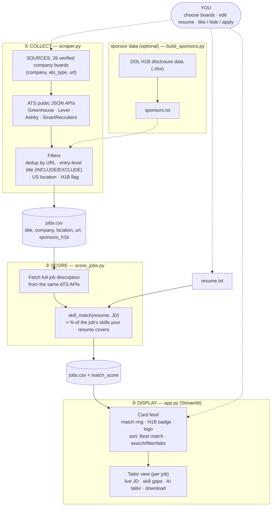

# Job-Search Tool — Architecture & Data Flow

Two scripts produce **`jobs.csv`**; the Streamlit app only reads it. No paid jobs API, no database — everything is file-based.

**Run order:** `python scraper.py` → `python score_jobs.py` → `streamlit run app.py`

## Stages

1. **COLLECT — `scraper.py`** — calls each board's public ATS JSON API, then keeps only postings that are new (deduped by URL), entry-level + on-target (title filter), US-based, and tags an H1B flag. Writes survivors to `jobs.csv`.
2. **SCORE — `score_jobs.py`** — pulls each job's full description from the APIs and scores it against `resume.txt` with `skill_match` (share of the job's skills your resume covers). Writes a `match_score` column.
3. **DISPLAY — `app.py`** — a Streamlit card feed that reads `jobs.csv`: match ring, H1B badge, logo, best-match sort, filters/tabs, and a per-job tailor view (live JD fetch, skill gaps, optional AI tailoring, download).

Solid arrows = data flow · dashed = your inputs / optional pieces.
